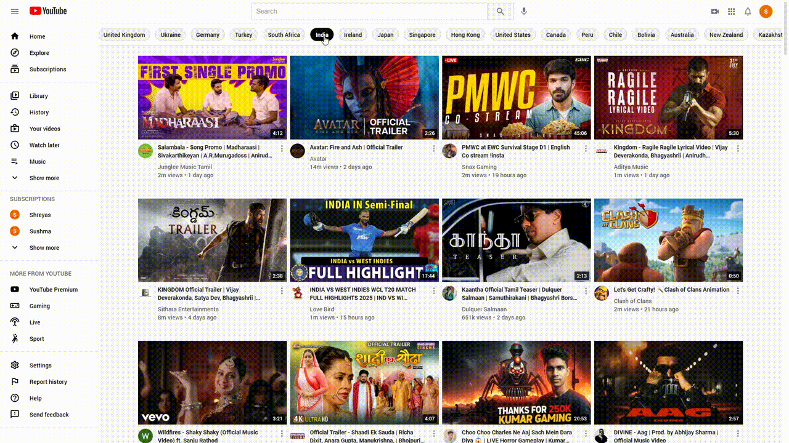
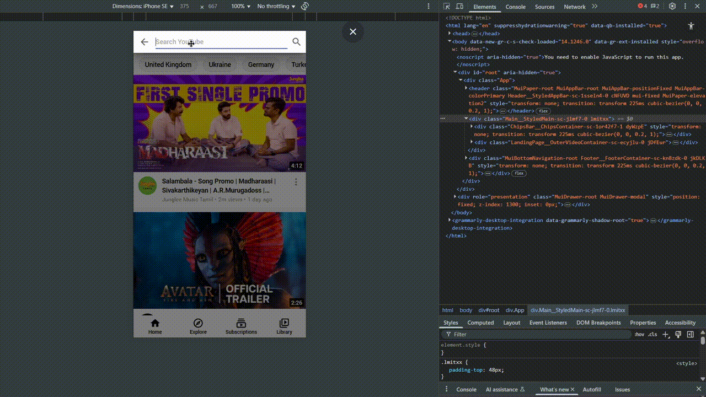

# 🎬 React YouTube Clone by Shreyas B. Acharya

A clean and responsive **YouTube homepage + search page** clone built using **React**, **Material UI**, and the **YouTube Data API v3**.

## 🚀 What This App Can Do

* 🔎 Real-time video search powered by YouTube API.
* 📺 Homepage shows the most popular videos by country.
* 📜 Infinite scroll on homepage for seamless video loading.
* 💬 Results include video or channel-type content.
* 🧭 Dynamic layout for desktop and mobile views.

---

## 🎯 Purpose of This Project

This project was built to:

* Master **React.js**, **Material UI**, and **styled-components**.
* Practice API integration using **axios**.
* Design responsive UIs with **React Router** and custom logic.
* Simulate a real-world product clone and strengthen my resume.

---

## 🧰 Tech Stack

* **React.js** (Vite or CRA)
* **React Router**
* **Material UI v5**
* **Styled-Components**
* **Axios**
* **YouTube Data API v3**
* **Jotai** (for minimal global state management)

---

## ⚠️ API Quota Limit Notice

**Heads up!**
YouTube API has a free quota of 5000 units/day. Each **search** costs **100 units**, while fetching popular videos by region costs just **1 unit**. If the app doesn’t load or search fails, it’s likely due to quota exhaustion. Please try again later!

---

## 📂 Key Features Breakdown

### 🌍 ChipsBar

* Shows a list of countries.
* Clicking loads the most popular videos in that region.
* Optimized to use minimal API quota.

### 🧭 Header / Navbar

* Responsive design for mobile & desktop.
* On smaller screens, search input opens in a modal/drawer.
* Sidebar behavior changes based on screen width.

### 🎞️ Video Cards

* Pop-up menu with dummy options.
* Lazy-loaded thumbnails for faster performance.

### 🔍 Search Page

* Displays 25 results per query.
* Each result could be a video or a channel, with dynamic rendering.

---


## 🔍 Side-by-Side Comparison

I aimed for visual fidelity. Here’s how my clone stacks up against real YouTube:

| Desktop – Home | Desktop – Search |
|---------------|------------------|
|  |  |

| Mobile – Home | Mobile – Search |
|--------------|-----------------|
|  |  |


While not 100% identical, the core layout, spacing, typography, and interaction patterns are closely matched.

---

## 🧪 Known Limitations

* Most buttons are UI-only (non-functional).
* Pop-up menus only close on click.
* Filtering and routing features are basic.
* No video playback embedded (yet).

---

## 💡 Why I Built It This Way

* **Using country-based ChipsBar** instead of search tags is more API-efficient.
* **Cached results in localStorage** during development helped me avoid exceeding API limits and allowed a smoother dev cycle.

---

## 🛠️ Run It Locally

```bash
# 1. Clone the repo
git clone https://github.com/shreyu-acharya/react-youtube-clone.git

# 2. Move into the folder
cd react-youtube-clone

# 3. Install dependencies
npm install

# 4. Start the dev server
npm start
```

---

## 👤 Author

**Shreyas B. Acharya**
Student at VTU | React Developer | CSE Enthusiast
📍 India

* [GitHub](https://github.com/shreyu-acharya)
* [LinkedIn](https://linkedin.com/in/your-link) *(add yours)*
* [Portfolio](https://your-portfolio.com) *(if any)*

---

## 🧠 Learning Outcome

This project taught me how to:

* Work with third-party APIs and quota management.
* Build a scalable frontend using clean, reusable components.
* Make responsive UIs that adapt well to mobile and desktop.
* Understand state management through `Jotai`.

---


